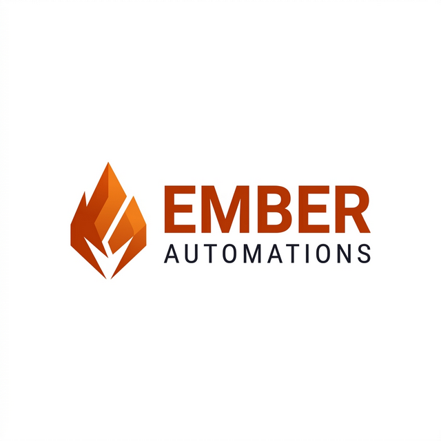

# Ember Automations — Brand Identity

> **Version:** 1.0 · March 2026  
> **Owner:** Edward Alec Somers  
> **Entity:** Ember Automations (Pty) Ltd *(in formation)*  
> **Location:** White River, Mpumalanga, South Africa

---

## Brand Essence

**What we do:** We build AI-powered automation platforms that help South African businesses work smarter — turning manual, repetitive digital tasks into intelligent, self-running systems.

**One-liner:** *Powering Local Media, Intelligently.*

**Personality:** Smart. Warm. South African. Premium without being cold. We're the technical expert who also speaks plain English.

---

## Logo

### Primary Logo *(light variant — preferred)*
Works on both light and dark backgrounds. Use this as the default across all contexts.



### Logo Files
| File | Background | Usage |
|------|-----------|-------|
| `logo-light.png` | White / light grey | **Primary** — proposals, documents, print, email signatures |
| `logo-transparent.png` | Transparent | Overlays, web embeds, any coloured background |
| `logo.png` | Dark (`#0a0a0f`) | Legacy dark UI variant (ember-social app) |

### Logo Rules
- **`logo-light.png`** is the preferred default — use this unless you need transparency
- **`logo-transparent.png`** is for any use where the background colour varies or is unknown
- Never recolour the flame icon; never stretch or distort the proportions
- Minimum size: 120px wide for digital, 30mm for print
- Maintain clear space of at least 1× the icon height on all sides

---

## Name Origin

### 1. The Core Meaning — Potential & Ignition *(2 Timothy 1:6)*

> *"For this reason I remind you to fan into flame the gift of God, which is in you..."*

The name draws from a subtle Christian/fire theme. Just as an ember is a small piece of glowing coal that holds intense heat and the potential to start a massive fire, Ember Automations takes the existing sparks of a client's business — their leads, traffic, raw data — and fans them into a roaring flame of growth and efficiency.

This positions us not just as a software provider, but as a **catalyst for client growth**.

### 2. High-Tech & Automotive Synergy

The name works powerfully across commercial sectors, particularly the initial target niche of **automotive** (e.g. Everest Motoring):

- **"Ember"** implies heat, combustion, energy, engines, and power.
- **"Automations"** implies systems, machinery, AI, and efficiency.

Together the name feels strong, industrial, and highly technical — exactly what an automotive dealership or tech-forward client wants from a SaaS provider.

### 3. Visual Branding & Distinction

The fire/ember motif provides a brilliant visual foundation:

- It naturally leads to the **Ember Orange, Deep Charcoal, and Soft Gold** palette.
- This stands out drastically against the typical "cool tech blues" and generic greens that dominate SaaS branding.
- It feels **premium, warm, and energetic** — instantly differentiated.

### 4. The "Start" — Reflecting the $0 Setup Model

The business model emphasises **zero setup cost** with ongoing monthly SaaS subscriptions. An ember is precisely that — a fast, low-barrier, high-heat *start*. It reflects the ability to get clients up and running quickly without a massive initial cash burn, while continuously providing energy (through monthly portals, automation, and AI) over time.

---

## Colour Palette

These are the official brand colours used across all Ember Automations products and materials.

### Primary — Ember Orange

| Name | Hex | Usage |
|------|-----|-------|
| `ember-500` | `#f97316` | Primary CTA buttons, links, active states, highlights |
| `ember-600` | `#ea580c` | Button hover, pressed states |
| `ember-700` | `#c2410c` | Deep accent, badge backgrounds |
| `ember-100` | `#ffedd5` | Light tint for backgrounds (light mode) |
| `ember-50`  | `#fff7ed` | Subtle wash, light mode only |

### Ember Gradient
Used for hero text, key headings, and premium UI moments:
```
linear-gradient(135deg, #f97316 0%, #fb923c 50%, #fbbf24 100%)
```

### Background — Dark Scale

| Name | Hex | Usage |
|------|-----|-------|
| `dark-900` | `#0a0a0f` | Page background, outermost layer |
| `dark-800` | `#13131a` | Sidebar, nav background |
| `dark-700` | `#1c1c27` | Card backdrops |
| `dark-600` | `#252535` | Dividers, hover states |
| `dark-500` | `#2e2e42` | Input fields, subtle surfaces |

### Surface & Border

| Name | Hex | Usage |
|------|-----|-------|
| `surface` | `#16161f` | Base card/panel surface |
| `surface-raised` | `#1e1e2e` | Elevated card (glassmorphism base) |
| `border` | `#2a2a3d` | Borders, separators, dividers |

### Text

| Roll | Hex | Notes |
|------|-----|-------|
| Primary text | `#e2e2f0` | Body copy on dark backgrounds |
| Muted text | `#6b6b8a` | Captions, labels, secondary info |
| Inverse text | `#0a0a0f` | Text on ember-orange buttons |

### Platform Colours (Ember Social)
These are reserved for social media platform identification only:

| Platform | Hex |
|----------|-----|
| Facebook | `#1877F2` |
| Instagram | `#E4405F` |
| LinkedIn | `#0A66C2` |
| TikTok | `#000000` |
| YouTube | `#FF0000` |

---

## Typography

### Primary Typeface — Inter

**Source:** Google Fonts — `https://fonts.google.com/specimen/Inter`

Inter is our sole typeface. It is clean, highly legible, and carries technical authority.

```css
font-family: 'Inter', system-ui, sans-serif;
```

### Type Scale

| Role | Weight | Size | Letter-spacing | Usage |
|------|--------|------|---------------|-------|
| Display | 800 (ExtraBold) | 48–72px | -0.02em | Hero headings |
| H1 | 700 (Bold) | 36–48px | -0.02em | Page titles |
| H2 | 600 (SemiBold) | 24–30px | -0.01em | Section headings |
| H3 | 600 (SemiBold) | 18–20px | 0 | Card titles |
| Body | 400 (Regular) | 15–16px | 0 | Body copy |
| Small / Label | 600 (SemiBold) | 11–13px | +0.04em (uppercase) | Badges, labels, captions |

### Heading Style Principles
- Section headings that introduce features or stats: use ember gradient on the key noun
- Labels and category tags: **all-caps, letter-spaced, ember-500**

---

## Voice & Tone

### We Are
- **Confident** — we know our product works
- **Clear** — no jargon where plain English will do
- **Warm** — we're South African, we build relationships
- **Solution-focused** — lead with the outcome, not the feature

### We Are Not
- Cold or corporate
- Overly casual or informal in client-facing materials
- Arrogant — we earn trust with results

### Key Phrases
| ✅ Use | ❌ Avoid |
|--------|---------|
| "Automate the work your team shouldn't have to do" | "Leverage AI synergies" |
| "Your clients see results, not just effort" | "Our platform leverages machine learning" |
| "One dashboard. Five platforms." | "Comprehensive multi-tenant SaaS architecture" |
| "Human-approved before it goes live" | "AI-controlled content pipeline" |

---

## Design Principles

### 1. Dark-First
All Ember Automations products default to dark mode. Light variants may be used for print documents and external-facing materials (proposals, media kits) only.

### 2. Glassmorphism Accents
Card surfaces use layered translucency:
```css
background: rgba(30, 30, 46, 0.7);
backdrop-filter: blur(12px);
border: 1px solid rgba(255, 255, 255, 0.06);
border-radius: 16px;
```

### 3. Ember Glow
Interactive elements and key CTAs carry a subtle ember glow to reinforce the brand warmth:
```css
box-shadow: 0 0 30px rgba(249, 115, 22, 0.15);
```

### 4. Micro-animation
All interactive elements should have smooth transitions (200–300ms ease). Hover states lift elements with scale or glow — never abrupt.

### 5. Data Density Without Clutter
Our products are data-rich. Use tight grid systems and consistent 8px spacing units. Separate sections with subtle border lines, not whitespace alone.

---

## Products Under the Ember Automations Brand

| Product | Description |
|---------|-------------|
| **Ember Social** | AI social media automation platform for agencies |
| **Ember News** | Multi-site news CMS with AI rewriting & auto-publishing |
| **Ember Directory** | Regional business directory with tiered listings & automation |

All products share the same design system and brand DNA, differentiated only by the subname.

---

## Company Details

| Field | Detail |
|-------|--------|
| **Trading Name** | Ember Automations |
| **Legal Entity** | Ember Automations (Pty) Ltd *(in formation)* |
| **Owner** | Edward Alec Somers |
| **Address** | Y17c Yaveland Road, White River, Mpumalanga, 1240 |
| **Country** | South Africa |
| **Quote prefix** | `EA-YYYY-###` |
| **Tagline** | *Powering Local Media, Intelligently.* |
