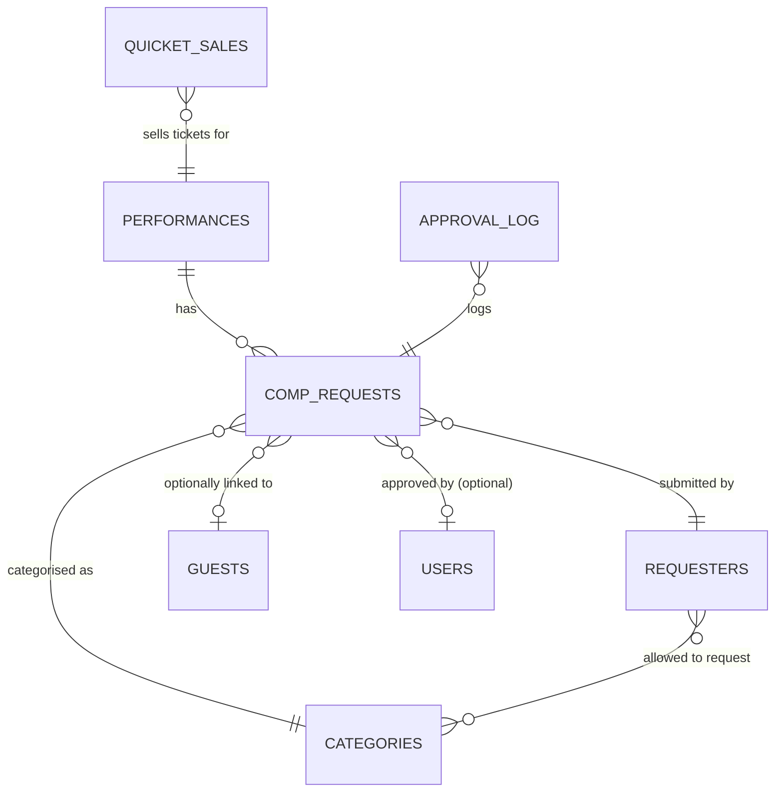
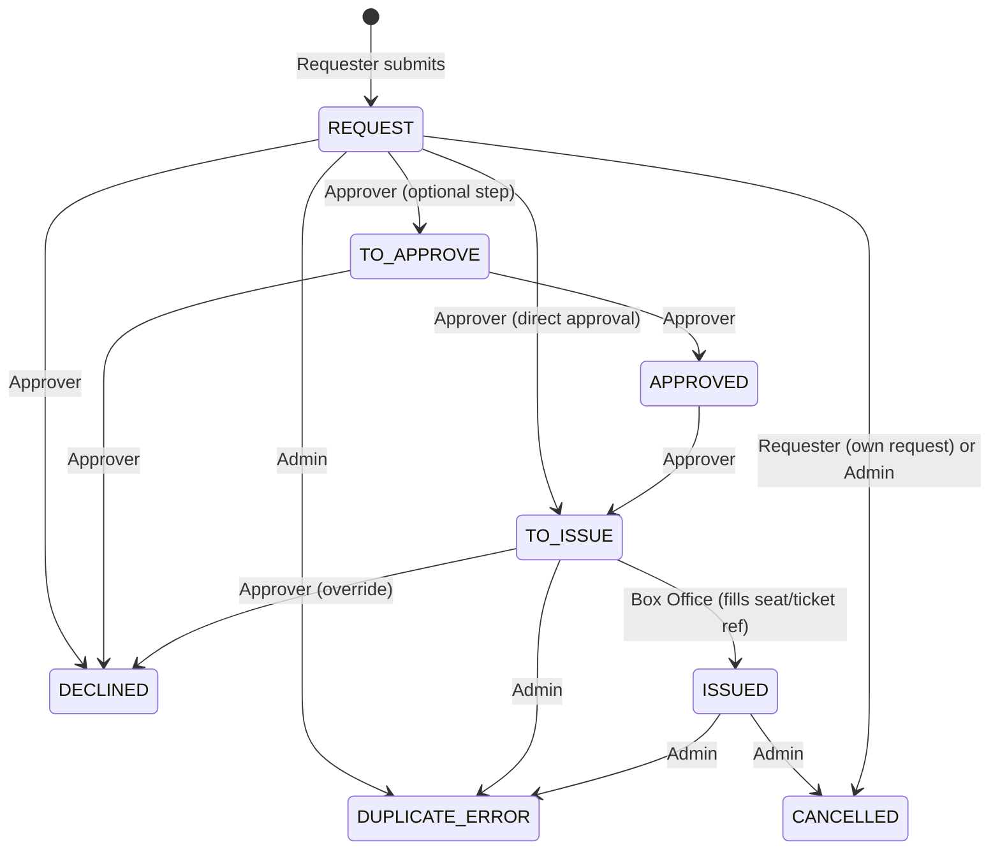

# 1. Overview & entity-relationship summary

The base contains 8 tables supporting the comp ticket workflow and future modules. Core relationships:
- A **Comp Request** is for a single **Performance**, uses one **Category**, is submitted by a **Requester**, and may optionally reference a deduplicated **Guest**.  
- **Approval Log** records every lifecycle change on a Comp Request.  
- **Quicket Sales** are linked to a Performance to sync ticketing data.  
- **Users** (internal staff) approve, edit, and perform actions; the **Requester** is also a contact but sits in its own table with per-requester category restrictions.  
- **Categories** are a controlled list shared between Requesters (allowed categories) and Comp Requests (actual category).  
- A **Season** is stored as a single-select field on Performances (no separate table) to allow multi-season operation without rebuild.

---

# 2. Table-by-table field dictionary

## 2.1 Performances

| Field | Type (Airtable) | Required | Notes/Validation |
|-------|-----------------|----------|------------------|
| Production/Event | Single line text | ✅ | Free text: e.g., “Don Quixote”, “Family Day Matinee” |
| Date | Date | ✅ | Date only (no time) |
| Time | Single line text | ✅ | e.g., “19:30”, “14:00” (validated by app) |
| Venue | Single line text | ✅ | e.g., “Open-Air Theatre”, “Flower Hall” |
| Capacity | Number | ✅ | Integer ≥ 0. Manually maintained by admin. |
| Season | Single select | ✅ | Options: `2025`, `2026`, `2027`… (add new season each year) |
| Quicket Event ID | Number |  | Reference from Quicket API; used for sync (unique) |
| Quicket Schedule ID | Number |  | Schedule identifier in Quicket; one performance per schedule |
| Performance Type | Single select | ✅ | `Public`, `School`, `SASL-interpreted`, `VIP` |
| Active | Checkbox | ✅ | Default `true`. Uncheck to hide from current season views. |
| Performance Label | Formula |  —  | `{Production/Event} & " — " & DATETIME_FORMAT({Date},'DD MMM YY') & " — " & {Venue}` (computed, read-only) |
| Comp Seats Requested | Rollup |  —  | Sum of `Total Seats Requested` from linked Comp Requests where `Ticket Status` is not `DECLINED`, `CANCELLED`, or `DUPLICATE/ERROR` |
| Comp Seats Issued | Rollup |  —  | Sum of `Total Seats Requested` from linked Comp Requests where `Ticket Status = "ISSUED"` |

## 2.2 Comp Requests

| Field | Type (Airtable) | Required | Notes/Validation |
|-------|-----------------|----------|------------------|
| AutoID | Autonumber |  —  | Internal sequential ID (hidden, computed) |
| Request Reference | Formula |  —  | `"REQ-" & {AutoID}` (computed, unique reference) |
| Guest Name | Single line text | ✅ |  |
| Guest Surname | Single line text | ✅ |  |
| Performance | Linked record → Performances | ✅ | Single-select performance |
| Category | Linked record → Categories | ✅ | Single-select category |
| Guest Email | Email | ✅ |  |
| House Seats | Checkbox |  | Indicates if special house seating is needed |
| Notes | Long text |  | Free notes (visible according to permissions) |
| Total Seats Requested | Number | ✅ | Integer ≥ 1 |
| Ticket Status | Single select | ✅ | Options: `REQUEST`, `TO APPROVE`, `APPROVED`, `TO ISSUE`, `ISSUED`, `DECLINED`, `CANCELLED`, `DUPLICATE/ERROR`. Default `REQUEST`. **Not editable by requester** (app enforced). |
| Seat Numbers | Single line text |  | Seat assignment (e.g., “A1-A4”) – Box Office / admin only |
| Ticket Reference | Single line text |  | E-ticket or box office reference – Box Office / admin only |
| Requester | Linked record → Requesters | ✅ | Auto-populated from magic-link token; hidden from requester in the form |
| Submitted At | Created time |  —  | Read-only timestamp |
| Approved By | Linked record → Users |  | Set by app when approval action performed |
| Approved At | Date & time (include time) |  | Manually set by app when approval occurs |
| Season | Lookup (from Performance) |  —  | Read-only, driven by Performance→Season |
| Missing Issue Data | Formula |  —  | `IF(AND({Ticket Status}="ISSUED", OR(TRIM({Seat Numbers})="", TRIM({Ticket Reference})="")), TRUE, FALSE)` |

## 2.3 Requesters

| Field | Type (Airtable) | Required | Notes/Validation |
|-------|-----------------|----------|------------------|
| Name | Single line text | ✅ | Full name |
| Email | Email | ✅ | Unique per requester |
| Role | Single select | ✅ | `Festival Organiser`, `PR & Media`, `Box Office`, `Sponsorships`, `Operations` |
| Allowed Categories | Linked record → Categories (multiple) | ✅ | Defines which categories this requester may request for |
| Magic Link Token | Single line text |  | Long random token generated by app (unique); used for passwordless authentication |
| Token Active | Checkbox | ✅ | Default `true`. Toggled by admin to enable/disable magic link. |
| Active | Checkbox | ✅ | Default `true`. Overall active/inactive flag. |
| Comp Requests | Linked record → Comp Requests |  —  | Reverse link (automatically managed). Shows all requests from this requester. |

## 2.4 Categories

| Field | Type (Airtable) | Required | Notes/Validation |
|-------|-----------------|----------|------------------|
| Category Name | Single line text | ✅ | Exact text: `Competition Winners`, `Cast/Crew/Team Comp`, `VIP`, `Media`, `Partner/Sponsor`, `Friends/Family`, `Box-Office` |
| Description | Long text |  | Internal note on usage |
| Active | Checkbox | ✅ | Default `true`. Uncheck to retire category. |

## 2.5 Guests / Contacts

| Field | Type (Airtable) | Required | Notes/Validation |
|-------|-----------------|----------|------------------|
| Full Name | Single line text | ✅ | Combined first and last name (or field per brief) |
| Email | Email | ✅ | Used for deduplication |
| Organisation | Single line text |  | Optional affiliation |
| Comp Requests | Linked record → Comp Requests |  —  | One-to-many link to past requests |
| Events Attended | Rollup |  —  | Count of linked Comp Requests where `Ticket Status = "ISSUED"`. (POPIA: sensitive – access must be restricted to admins only) |

## 2.6 Quicket Sales

| Field | Type (Airtable) | Required | Notes/Validation |
|-------|-----------------|----------|------------------|
| Performance | Linked record → Performances | ✅ | Links to the relevant performance |
| Quicket Ticket Type ID | Number | ✅ | Unique ID from Quicket API |
| Ticket Type Name | Single line text | ✅ | e.g., “Adult”, “Concession” |
| Price | Currency | ✅ |  |
| Quantity Sold | Number | ✅ | Integer ≥ 0 |
| Gross | Formula |  —  | `{Price} * {Quantity Sold}` (computed in Airtable) |
| Synced At | Date & time (include time) | ✅ | Timestamp of last successful Quicket sync (set by app) |
| Quicket Event ID | Lookup (from Performance) |  —  | Auto-populated from linked Performance |
| Quicket Schedule ID | Lookup (from Performance) |  —  | Auto-populated |

## 2.7 Approval Log

| Field | Type (Airtable) | Required | Notes/Validation |
|-------|-----------------|----------|------------------|
| Related Comp Request | Linked record → Comp Requests | ✅ | Which request this log entry belongs to |
| Action | Single select | ✅ | `Submitted`, `Approved`, `Declined`, `Issued`, `Status Override`, `Edited`, `Cancelled` |
| Performed By | Linked record → Users | ✅ | Staff member who performed the action |
| Timestamp | Created time |  —  | Auto-generated |
| From Status | Single select | ✅ | Options mirror `Ticket Status` choices. Captures previous status. |
| To Status | Single select | ✅ | Options mirror `Ticket Status` choices. New status after action. |
| Note | Long text |  | Optional explanation (e.g., decline reason) |

## 2.8 Users / Roles

| Field | Type (Airtable) | Required | Notes/Validation |
|-------|-----------------|----------|------------------|
| Name | Single line text | ✅ | Full name |
| Email | Email | ✅ | Matches login or internal email |
| Role | Single select | ✅ | `Admin` (Jaco/Wessel), `Box Office`, `PR & Media`, `Sponsorships`, `Operations` |
| Department | Single line text |  | Optional organisational detail |
| Can Approve | Checkbox | ✅ | Default `false`. When checked, user may transition requests to `TO ISSUE` or `DECLINED` (and optionally through `TO APPROVE`/`APPROVED`). |
| Active | Checkbox | ✅ | Default `true`. Deactivate instead of deleting. |

---

# 3. Ticket status lifecycle

**Transition authority** (enforced by Next.js app):
- **Requester**: Can submit → `REQUEST`, cancel own → `CANCELLED` (only if status is still `REQUEST`).
- **Approver** (Jaco, Wessel, Rauen – users with `Can Approve = true`): Can move `REQUEST` → `TO ISSUE` or `DECLINED`, and optionally use the intermediate `TO APPROVE` / `APPROVED` states before `TO ISSUE`.
- **Box Office** (Jeff): Can move `TO ISSUE` → `ISSUED` and fill `Seat Numbers` and `Ticket Reference`. Cannot change to any other status.
- **Admin override**: `CANCELLED` and `DUPLICATE/ERROR` are reachable from most statuses by super admins (Jaco/Wessel).

---

# 4. Requester → allowed-category matrix

| Requester (Role)               | Competition Winners | Cast/Crew/Team Comp | VIP | Media | Partner/Sponsor | Friends/Family | Box-Office |
|--------------------------------|---------------------|----------------------|-----|-------|-----------------|----------------|------------|
| Jaco van Rensburg (Festival Organiser) | ✓ | ✓ | ✓ | ✓ | ✓ | ✓ | – |
| Wessel Odendaal (Festival Organiser)   | ✓ | ✓ | ✓ | ✓ | – | ✓ | – |
| Rauen Venter (Festival Organiser)      | ✓ | ✓ | ✓ | ✓ | ✓ | ✓ | – |
| Sascha Polkey (PR & Media)              | – | – | ✓ | ✓ | – | – | – |
| Jeff Brooker (Box Office)              | – | – | – | – | – | – | ✓ |
| Kerry Burns (Sponsorships)             | ✓ | – | – | – | ✓ | – | – |
| Alyssa van der Schyff (Operations)     | ✓ | ✓ | ✓ | ✓ | ✓ | – | – |

**How it works**:  
When a requester logs in via magic link, the app reads their `Requesters.Allowed Categories` (linked) and renders **only those categories** as options in their comp request form. The Rest API enforces that a submitted request’s `Category` is within the requester’s allowed set. This table is stored in the `Requesters` table and can be updated by admins without code changes.

---

# 5. Permission matrix (role × capability)

Permissions are enforced **server-side in the Next.js app** against a **single Maynardville-owned Airtable service token**. End-users have no Airtable logins, so the app is the sole gatekeeper; there are no per-user Airtable seats or interface permissions to maintain. Per-user accountability comes from the **Approval Log** table, written by the app on every privileged action.

| Role / Person Group          | Comp Requests – View | – Create | – Edit Fields | – Edit Status | Performances | Quicket Sales | Requesters | Categories | Guests | Approval Log | Users |
|------------------------------|-----------------------|-----------|---------------|----------------|--------------|---------------|------------|------------|--------|---------------|-------|
| **Requester (self)**         | Own only              | Yes       | None          | None           | Read (all active) | None        | Own record (read) | Read allowed cats | None   | None          | None  |
| **Jaco / Wessel (Admin)**    | All (full read)       | Yes       | All fields (incl. Seat Numbers, Ticket Reference, Notes) | Full approve/override | Full read/write | Full read | Full read/write | Full read/write | Full read | Full read (write via log) | Full read/write |
| **Rauen Venter (Festival Organiser)** | All (full read)       | Yes       | All fields (excl. Seat Numbers, Ticket Reference – admin only) | Approve (`REQUEST`→`TO ISSUE`/`DECLINED`) | Read active | Read | Read (own & others) | Read | Read | Read | Read |
| **Jeff Brooker (Box Office)**| `TO ISSUE` records only | No | `Seat Numbers`, `Ticket Reference` only | `TO ISSUE` → `ISSUED` only | Read active | Read (for reconciliation) | Own record (read) | Read “Box-Office” cat | None | Read own actions | Read own |
| **Sascha Polkey (PR & Media)** | All requests with category `Media` or `VIP` | Yes (only those cats) | `Notes` field (optional) | None | Read active | None | Own record (read) | Read “Media”,“VIP” | None | None | None |
| **Kerry Burns (Sponsorships)** | All requests with category `Competition Winners` or `Partner/Sponsor` | Yes (only those cats) | `Notes` field (optional) | None | Read active | None | Own record (read) | Read own allowed | None | None | None |
| **Alyssa van der Schyff (Operations)** | All requests with categories `Competition Winners`, `Cast/Crew/Team Comp`, `VIP`, `Media`, `Partner/Sponsor` | Yes (only those cats) | `Notes` field (optional) | None | Read active | None | Own record (read) | Read own allowed | None | None | None |

**Single-account model**:  
- One Maynardville-owned Airtable account holds a single Personal Access Token (Creator-scoped to this base) used by the Next.js server for all reads/writes. No end-user has an Airtable login.
- Because that token is privileged, **all authorisation lives in the app** (enforced on every API route) — Airtable is not relied upon as a secondary lock. Keep the token server-side only, scoped to this base, and rotate periodically.
- Optional: if a staff member needs to edit raw data directly in Airtable, add a paid seat for them; otherwise a single seat suffices.

---

# 6. Quicket field mapping

| Quicket API endpoint / object       | Quicket field                | Airtable table / field                  | Notes |
|-------------------------------------|------------------------------|------------------------------------------|-------|
| Event (`/events/{id}`)              | `id`                         | Performances → `Quicket Event ID`        | Manual entry per Performance |
| Schedules (`/schedules?event=`)     | schedule `id`                | Performances → `Quicket Schedule ID`     | One schedule = one Performance |
| Schedules                           | schedule `startDate`         | Performances → `Date`                    | For mapping/reference |
| Ticket types (`/ticket_types?event=`) | `id`, `name`, `price`      | Quicket Sales → `Quicket Ticket Type ID`, `Ticket Type Name`, `Price` | Sync per performance |
| Sales summary (`/reports/tickets/` etc.) | `quantity_sold`, `gross` (derived) | Quicket Sales → `Quantity Sold`, `Gross` (computed in Airtable) | App calculates totals per ticket type |
| Guest list (`/guest_list?schedule=`) | guest names, emails          | Reconciliation against Comp Requests     | Not stored in Quicket Sales; used during sync to mark issued comps |

**Important**:  
- Quicket does **not** provide seat numbers or the venue’s true physical capacity. Those fields (`Seat Numbers`, `Capacity`) are maintained in Airtable via the comp workflow.  
- The Quicket sync app writes to `Quicket Sales` and optionally compares the guest list with comp requests to detect discrepancies.

> **Accuracy note (verified against docs.quicket.com):** The endpoint paths in the table above are illustrative. In the real Quicket API, `tickets[]` and `schedules[]` are **embedded in the Event object** at `GET https://api.quicket.co.za/api/Events/{id}` — there are no separate `/schedules` or `/ticket_types` endpoints. Auth = `api_key` in the query string (from developer.quicket.co.za) **plus** a `usertoken` request header for private resources such as the guest list. Sold quantities/gross are derived from the **purchase-webhook** stream and/or guest-list counts. Confirm the exact guest-list endpoint and rate limits in Phase 1 against Maynardville's live account.

---

# 7. Season rollover

The base supports multiple seasons without a rebuild. Runbook for a new festival year (e.g., 2026):

1. **Add Season value**  
   In the `Performances` table, add a new option to the `Season` single select field, e.g., `"2026"`.

2. **Create new season’s performances**  
   Duplicate the previous season’s structure or enter new `Performances` records with `Season = 2026`. Check `Active = true`. Old records with `Season = 2025` remain unchanged; their `Active` flag may be unchecked to hide them from default views.

3. **Update app views**  
   The Next.js app uses the `Season` field (or a parameter) to filter queries, e.g., `{Season} = "2026"`. Set the current season via an environment variable or admin config.

4. **Maintain requesters & categories**  
   Requester profiles stay valid; if roles/categories change for the new season, update `Allowed Categories` on the `Requesters` table. The `Categories` table remains stable (add/activate new categories if needed).  

5. **Sync Quicket for new season**  
   When the new Quicket event and schedules are created, fill in `Quicket Event ID` and `Quicket Schedule ID` on the new performances. The Quicket sync continues as before; old `Quicket Sales` records remain historical.

6. **Archive old data (optional)**  
   For clarity, create an `"Archive 2025"` base copy or simply filter views by `Season != "2025"` where needed. Since Airtable’s row limits are generous, keeping historical data in the same base is acceptable; the `Season` field cleanly separates years. No database migration or rebuild is required.