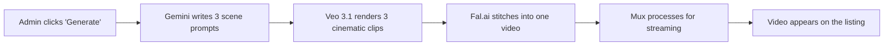

# Everest Motoring — Platform Feature Breakdown

**Built by Antigravity Digital** · Last Updated: 23 February 2026

---

## Technology Stack

| Layer | Technology | Why It Matters |
|-------|-----------|----------------|
| Framework | Next.js 16 | Google-optimised, ultra-fast page loads, server-side rendering for SEO |
| Database & Auth | Supabase (PostgreSQL) | Enterprise-grade database with built-in authentication and file storage |
| AI Engine | Google Gemini, Veo 3.1, Fal.ai | Automated video production and intelligent content generation |
| Video Hosting | Mux | Netflix-grade adaptive video streaming on any device |
| Styling | Tailwind CSS | Modern, responsive design system |
| Hosting | Vercel | Global CDN, 99.99% uptime, instant deployments |

---

## ✅ Delivered Features

---

### 1. Public Website

#### Homepage

**How it works:** The homepage is the dealership's digital showroom. It instantly communicates professionalism and trust through a clean, modern design with the Everest branding. Featured vehicles from the live inventory are automatically displayed — when you add a car in the admin panel, it appears on the homepage in real time. No manual website updates needed.

**How it helps the business:**
- First impressions matter — a polished homepage converts casual browsers into leads
- Featured vehicles drive traffic to your highest-priority stock
- Trust indicators (years in business, number of vehicles sold) build confidence before a customer even walks in
- Mobile-responsive design captures the 70%+ of South African users who browse on their phones

---

#### Vehicle Inventory (`/inventory`)

**How it works:** Every vehicle you add through the admin panel is automatically listed on a public inventory page with its own dedicated detail page. Customers can browse the full grid, view high-resolution photos, read specifications, watch the AI-generated cinematic video walkaround, and submit an inquiry — all without leaving the website.

The inquiry form on each vehicle page creates a **lead** in your admin CRM, capturing the customer's name, phone number, and email. If the customer arrived via an affiliate's tracking link, that referral is automatically attributed.

**How it helps the business:**
- Your inventory is always live and accurate — no lag between adding a car and it appearing online
- Each vehicle has its own shareable URL, perfect for WhatsApp marketing and social media
- The built-in inquiry form captures leads 24/7, even when the showroom is closed
- Affiliate tracking means you always know which salesperson brought in which customer
- AI video walkarounds make listings stand out from every other dealership in the market

---

#### Value My Car (`/value-my-car`)

**How it works:** A dedicated landing page where potential sellers can submit their vehicle details (registration number, make/model, year, mileage) along with their contact information. Each submission is stored in the database and appears instantly in the admin Trade-In dashboard for your procurement team to action.

**How it helps the business:**
- Creates a **second revenue stream** — not just selling cars, but actively sourcing stock at competitive prices
- Pre-qualified leads: the customer has already expressed intent to sell, so your team is not cold-calling
- Captures vehicle data upfront (registration, mileage), saving your team time on the first call
- WhatsApp and call actions in the admin let your team respond within minutes, dramatically increasing conversion rates

---

### 2. Admin Panel

> Only accessible to users with the `admin` role. Unauthorized users are automatically redirected.

#### Mission Control Dashboard

**How it works:** The dashboard pulls live data from the database and displays it in easy-to-read cards. You see three critical business metrics at a glance:

1. **Inventory Health** — How many vehicles are on the floor, total stock value in Rands, how many are reserved/pending
2. **Sales Velocity (This Month)** — Total inquiries received, how many are at finance stage, how many deals closed, trade-in requests
3. **Trade-In Volume** — Total valuation requests from the public "Value My Car" page

All numbers update instantly. No spreadsheets, no manual counting.

**How it helps the business:**
- The Dealer Principal gets a real-time health check of the entire operation in 5 seconds
- Inventory value tracking helps with floor planning and cash flow decisions
- Monthly sales velocity data shows whether marketing is working and where the pipeline is stuck
- Spots problems early — if inquiries are up but closed deals are flat, there's a conversion issue to address

---

#### Inventory Manager

**How it works:** A full vehicle management system. You can:
- **Add** a new vehicle with all details: make, model, year, price, mileage, colour, transmission, fuel type, description, photos, and a feature checklist (sunroof, leather seats, alloy wheels, etc.)
- **Edit** any existing vehicle's details at any time
- **Delete** vehicles when they're sold or no longer available
- **AI-Optimize Descriptions**: Click one button and Google Gemini rewrites your vehicle description into professional, engaging dealership copy
- **Generate AI Video**: Click one button and the system automatically produces a cinematic video walkaround (see AI Video Engine section below)

Changes take effect immediately on the public website — no publish button, no waiting.

**How it helps the business:**
- Eliminates the need for a web agency to update listings — your team manages everything
- AI descriptions save hours of copywriting and produce consistent, professional results
- Feature checklists ensure no selling point is missed on a listing
- Photo upload directly from the admin means no complicated FTP or file managers
- The status system (Available/Reserved/Sold) prevents customer frustration from enquiring about cars that are already gone

---

#### Car Inquiries / Lead Manager (CRM)

**How it works:** Every time a customer submits an inquiry on a vehicle listing, it creates a lead in this system. Each lead shows:
- Customer details (name, phone, email)
- Which vehicle they're interested in (with photo and price)
- When the inquiry was made
- Current deal status: `New` → `Contacted` → `Finance Pending` → `Closed Won`
- Which affiliate referred them (or "Organic Direct" if they found the vehicle themselves)

Your team can take action directly from the table:
- **WhatsApp**: Opens WhatsApp with a pre-written message including the customer's name and the vehicle they enquired about
- **Call Client**: One tap to dial the customer
- **Invite & Request Docs**: Sends the customer a magic link email, creates their account, links them to their vehicle deal, and opens their Client Portal where they can upload finance documents

**How it helps the business:**
- **Speed to lead** is the #1 factor in closing car deals. WhatsApp pre-filled messages mean your team can respond in under 60 seconds
- No leads fall through the cracks — everything is captured and visible
- The status pipeline gives management visibility into where every deal stands
- Affiliate attribution ensures salespeople get credit for their referrals, maintaining trust in the commission structure
- The "Invite & Request Docs" workflow turns a 3-day document chase into a 1-click action — the customer uploads everything themselves from their phone

---

#### Trade-In Valuations

**How it works:** All submissions from the public "Value My Car" form land here. Your procurement team sees the customer's name, phone number, vehicle details (make/model, year, registration plate, odometer reading), the date submitted, and can update the status as they progress through the evaluation.

Status options: `New` → `Contacted` → `Offered` → `Closed`

One-click WhatsApp and Call actions are available for every request, with pre-filled messages mentioning the customer's vehicle.

**How it helps the business:**
- Centralises all trade-in leads in one place — no lost WhatsApp messages or sticky notes
- Registration plates and odometer readings give your buyer enough information to do a preliminary desktop valuation before calling the customer
- Status tracking prevents duplicate outreach (multiple staff members calling the same customer)
- The speed of response (with pre-filled WhatsApp) gives you a competitive edge over dealerships that take days to reply

---

#### Affiliate Network Manager

**How it works:** This is the command centre for managing your external salesforce. You can see:
- Every registered affiliate (name, phone, tracking code, join date)
- Their performance metrics: total leads generated, deals closed, estimated pending commissions
- Network-wide totals: total affiliates, total network leads, total network closed deals
- Approval toggle (activate or deactivate affiliates)

Commission estimates are calculated automatically based on the vehicle prices in each affiliate's pipeline.

**How it helps the business:**
- Scales your sales team without fixed salary costs — affiliates earn only when they generate business
- Full visibility into who is performing and who isn't, enabling data-driven decisions about your network
- Commission transparency builds trust with affiliates and reduces disputes
- The approval system gives you control over who represents your brand
- Effectively turns every person in your network into a mobile salesperson with their own tracking link

---

### 3. Client Portal

> Clients receive access via an automated invite email sent from the admin Lead Manager.

**How it works:** When your sales team clicks "Invite & Request Docs" on a lead, the customer receives an email with a magic link. Clicking it creates their account and drops them into a personalised portal showing:

1. **Their Vehicle Deal Card** — The vehicle they're buying (photo, make/model/year, price), their assigned sales agent's name, and the current deal status
2. **Finance Application Progress Bar** — A visual percentage showing how many of the 7 required documents have been uploaded
3. **Document Upload Slots** — Seven clearly labeled upload cards:
   - South African ID (Front & Back)
   - Proof of Address (Utility Bill)
   - Most Recent Payslip
   - Payslip 2 (Last Month)
   - Payslip 3 (2 Months Ago)
   - 3 Months Bank Statements (PDF)
   - Valid Driver's License

Each document slot shows its status (`pending`, `uploaded`, `approved`, `rejected`). Files upload directly to secure cloud storage.

When all 7 documents are uploaded, the progress bar hits 100% and displays a success message: *"All documents received. We are processing your finance application with the banks."*

**How it helps the business:**
- **This is the single biggest time-saver in the entire platform.** Gathering finance documents is traditionally a multi-day process involving phone calls, WhatsApp messages, and chasing. The portal reduces this to one link and one session on the customer's phone
- Customers upload documents at their own pace — they can pause and come back, no information is lost
- Progress visibility motivates customers to complete their uploads quickly
- The status system (pending/approved/rejected) lets your team quality-check documents before submitting to banks, preventing rejections
- Professional portal experience builds confidence that the customer is dealing with a tech-forward, organised dealership
- Reduces deal fall-through: the friction of gathering paperwork is the #1 reason deals die between "I want this car" and "sign here"

---

### 4. Affiliate Portal

> Accessible to users with the `affiliate` role. Each affiliate only sees their own data.

#### Pipeline Dashboard

**How it works:** Affiliates log into their own portal and see a dashboard showing:
- **Total Referrals**: How many customers they've sent
- **Active Deals**: Leads currently in the `contacted` or `finance_pending` stage
- **Closed Won**: Successfully completed deals
- **Estimated Pipeline Value**: Calculated commission based on active pipeline (currently set at 1%)

Below the metrics is a full table showing every lead they've referred, including customer name, phone, the vehicle they enquired about (with image and price), referral date, and deal status.

#### Link Generator

**How it works:** Affiliates browse the current available inventory and, with one click, generate a unique tracking URL for any vehicle. This URL contains their personal affiliate code (e.g., `?ref=JANE123`). When a customer clicks this link and submits an inquiry, the lead is automatically attributed to that affiliate.

**How it helps the business:**
- Affiliates can see their own performance in real time — this is a powerful motivator and builds trust
- Commission transparency eliminates disagreements about "who brought in that client"
- The link generator makes it effortless for affiliates to market individual vehicles on WhatsApp, Facebook, Instagram, and anywhere else
- Pipeline value estimates give affiliates a financial incentive to follow up on their own leads and push deals forward
- The entire referral-to-attribution process is automated — no manual tracking spreadsheets

---

### 5. Authentication & Security

**How it works:** The platform uses Supabase Auth, an enterprise-grade authentication system. Three user roles are enforced:
- **Admin**: Full access to the admin panel, inventory, CRM, trade-ins, affiliates
- **Affiliate**: Access to affiliate portal only, scoped to their own data
- **Client**: Access to client portal only, scoped to their own deal

Server-side middleware checks every request. If an unauthenticated user tries to access a protected page, they're redirected to login. If an authenticated user tries to access a section they're not authorised for, they're redirected to the homepage.

**How it helps the business:**
- Customer documents (IDs, payslips, bank statements) are protected behind authentication — POPIA compliance
- Role separation means affiliates can never see admin data, and clients can never see other clients' data
- Magic link authentication (email with a login link) means no password management headaches for customers
- Admin role protection ensures only authorised staff can manage inventory and view sensitive CRM data

---

### 6. AI Video Engine

**How it works:** When an admin clicks "Generate Video" on a vehicle listing, a fully automated pipeline fires:

1. **Creative Director (Gemini)**: Google's AI reads the vehicle specs and writes 3 cinematic scene descriptions (e.g., "A sleek black Fortuner cruising through Highveld sunset, camera tracking at wheel level...")
2. **Video Engine (Veo 3.1)**: Google's latest video generation model renders 3 high-quality clips in parallel (~1-3 minutes)
3. **Stitcher (Fal.ai)**: The 3 clips are seamlessly concatenated into one smooth video
4. **Streaming (Mux)**: The final video is ingested into Mux for adaptive streaming — it plays perfectly on any connection speed, any device

The admin UI shows real-time progress: `processing` → `rendering clips` → `stitching video` → `ingesting to Mux` → `ready`

**Also includes: AI Description Optimizer** — One click and Gemini rewrites a basic vehicle description into polished, professional dealership copy.

**How it helps the business:**
- Professional video content for every listing **without hiring a videographer or editor**
- Video listings get 3-5x more engagement than photo-only listings on Facebook Marketplace and AutoTrader
- Unique, cinematic content differentiates Everest from every competitor using the same static photos
- The entire process is automated — no uploading, no editing, no rendering. One click and walk away
- Mux adaptive streaming means the video plays smoothly even on slow mobile data, where most South African customers browse
- AI-optimized descriptions ensure every listing reads professionally, maintaining brand consistency across 50+ vehicles

---

## 🔮 Planned Features (Roadmap)

### Phase 8: Automated PDF Reporting
An n8n automation engine will compile all live dashboard metrics into a branded PDF report and email it directly to the Dealer Principal on a monthly schedule. The report will cover inventory health, sales velocity, affiliate performance, and trade-in volume — no manual work required.

### SMS / WhatsApp Notifications
Automated messages to clients when their document status changes (approved/rejected), when their deal moves to the next stage, and reminders to complete uploads.

### Advanced Analytics Dashboard
Conversion funnel visualisation (inquiry → contact → finance → closed), average time-to-close per vehicle, affiliate leaderboard with ranking, and month-over-month trend charts.

### Multi-Dealership Support
Franchise-level administration with per-location inventory, separate dashboards, and consolidated reporting across branches.

### Finance API Integration
Direct submission of completed document packs to bank finance APIs (MFC, WesBank, Standard Bank), eliminating manual re-uploads and accelerating approval times.

---

## Database Schema

| Table | Purpose | Business Function |
|-------|---------|-------------------|
| `profiles` | User accounts with roles (admin/affiliate/client), affiliate codes, approval status | Controls who can access what |
| `cars` | Full vehicle inventory including specs, photos, AI video URLs, status | The core product catalogue |
| `leads` | CRM data linking customers to vehicles, with status pipeline and affiliate attribution | Tracks every sales opportunity |
| `lead_documents` | Uploaded finance documents per lead (type, status, storage path) | Powers the client portal document flow |
| `value_my_car_requests` | Trade-in valuation submissions from the public form | Sources procurement leads |

---

*Built with precision by Antigravity Digital — Empowering dealerships with intelligent technology.*
